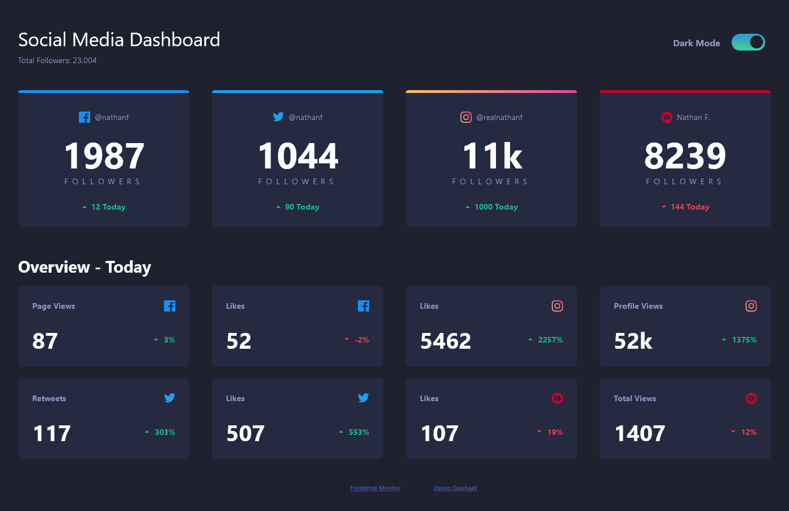
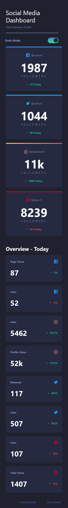
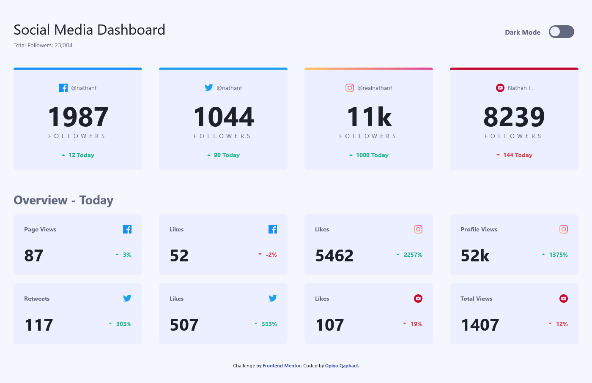
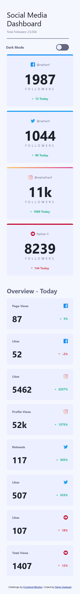

# Frontend Mentor - Social media dashboard with theme switcher solution

This is a solution to the [Social media dashboard with theme switcher challenge on Frontend Mentor](https://www.frontendmentor.io/challenges/social-media-dashboard-with-theme-switcher-6oY8ozp_H). Frontend Mentor challenges help you improve your coding skills by building realistic projects. 

## Table of contents

-   [Overview](#overview)
  - [The challenge](#the-challenge)
  - [Screenshot](#screenshot)
  - [Links](#links)
  - [Built with](#built-with)
  - [What I learned](#what-i-learned)
  - [Useful resources](#useful-resources)
  - [Author](#author)


## Overview
This is the front end mentor challenge recreation of Social media dashboard with theme switcher solution I did following my other frontend mentor code challenges

### The challenge

Users should be able to:

- View the optimal layout for the site depending on their device's screen size
- See hover states for all interactive elements on the page
- Toggle color theme to their preference

### Screenshot






### Links

- Solution URL: [Add solution URL here](https://your-solution-url.com)
- Live Site URL: [Add live site URL here](https://your-live-site-url.com)

## My process

### Built with

- Semantic HTML5 markup
- CSS custom properties
- Flexbox
- CSS Grid
- vscode

### What I learned

I learned and practiced a great deal of flex property in this challenge for positioning
I learnt how to create toggler which was challenging but i made it work.
I learnt how to change dark theme and light theme for my webpage
I also learnt how to use grid for positioning of divs and the boxes in the page

```html
<h1>Some HTML code I'm proud of</h1>

<!-- ############### BAR ############### -->
<nav class="navbar">
  <div class="grid--nav">
    <div class="heading--container">
      <h1 class="title">Social Media Dashboard</h1>
      <p class="subtitle">Total Followers: 23,004</p>
    </div>

    <div class="theme-toggle--container">
      <p class="theme--text">Dark Mode</p>

      <div class="theme-toggler">
        <span class="toggler"></span>
    </div>

    </div>
  </div>
</nav>

```
```css
.proud-of-this-css {
  color: papayawhip;
}

/* ############### THEME CHANGER ############### */

.theme-toggler {
  display: flex;
  align-items: center;
  justify-content: center;
}

.theme-toggler .toggler {
  height: 30px;
  width: 60px;
  border-radius: 50px;
  background: var(--light-color);
  position: relative;
  cursor: pointer;
  border: var(--border);
  margin: 0 10px;
}

.theme-toggler .toggler::before {
  content: "";
  position: absolute;
  background: var(--light-bg);
  top: 2.3px;
  left: 2px;
  height: 23px;
  width: 23px;
  border-radius: 50%;
  transition: 0.2s linear;
}

.theme-toggler.active .toggler::before {
  left: 32px;
}

```
```js
const proudOfThisFunc = () => {
  console.log('🎉')
}

// ################## THEME CHANGER ####################
let themeToggler = document.querySelector('.theme-toggler');

themeToggler.onclick = () =>{

    themeToggler.classList.toggle('active');

    if(themeToggler.classList.contains('active')){
        document.body.classList.add('active');
    }else{
        document.body.classList.remove('active');
    }

}

```

### Useful resources

- [unicon icons ](https://iconscout.com/unicons) - This helped me for icons.
- [google fonts](https://fonts.google.com/) - This helped me for fonts i used in this challenge.

## Author

- Website - [Qaphael Opiyo](https://qaphael-portfolio-website.web.app/)
- Frontend Mentor - [@Qaphael](https://www.frontendmentor.io/profile/Qaphael)
- Twitter - [@laflo__lr](https://twitter.com/Laflo_lr)
- Github - [@Qaphael](https://github.com/Qaphael)

